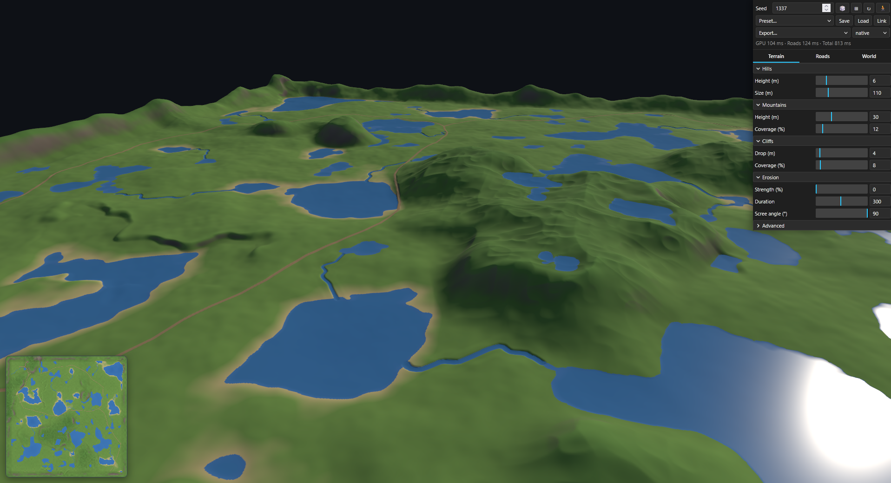

# Heightmap Level Generator

**Free procedural terrain and heightmap generator for Unreal Engine, Unity and Godot, running in your browser.
No install, no account.**

Generates game-ready terrain on the GPU (WebGPU compute shaders, WGSL): a 16-bit heightmap at 0.5 m per pixel
(1024×1024 for the default 512 m map, up to 2560×2560 at 1280 m) with a road network, towns, cliffs, hills, mountains,
erosion, rivers and lakes inside a closed border ring, in four biomes: temperate, steppe, desert and snow world.
Tweak everything live, walk through it in first person and
export heightmap, splatmap, masks, road and town layout and a 3D mesh for your engine: Unreal Engine landscape
(16-bit PNG / `.r16`), Unity terrain (`.r16`), Godot Terrain3D or three.js / glTF.

**▶ Try it in your browser: https://m-w-marker.github.io/heightmap-level-generator/** (needs WebGPU, e.g. current desktop Chrome or Edge)



## Use cases

- Blockout and prototype terrain for open-world, survival and racing levels
- Heightmaps for Unreal Engine 5 landscapes, Unity terrains and Godot Terrain3D, with the import values in the metadata
- Road splines, town clearings and water masks as input for PCG, Houdini or your own placement scripts
- Terrain for WebGPU / three.js scenes (glTF mesh with color texture)

## Features

**Terrain**
- **GPU generation**: WGSL compute shader, regenerates while you drag sliders; generation time shown in the panel
- **Seed-based**: same seed + parameters, same terrain; compare 12 seeds side by side (⊞) and pick one
- **Cliffs, hills, mountains**: amplitudes in meters, coverage in % of the map
- **Erosion**: rain and scree wear the terrain on the GPU (gullies on the flanks, sediment in the valleys), optional
  scree slopes below cliffs (off by default; *Eroded mountains* preset)
- **Rivers and lakes**: rivers grow from the drainage of the terrain and run downhill into lakes, the sea or the foot
  of the border ring; hollows fill up to their outflow and become lakes with their own water level; a real water
  surface in 3D (*River valley* preset)
- **Border ring**: closed raised terrain around the map edge that hides the horizon; exit roads end at its foot
- **Map size**: 256–1280 m in 64 m steps; all meter values keep their meaning, a larger map shows more of the same landscape at the
  same detail (all grids grow with it; ~1 s per generation at 1280 m)
- **Auto height range**: `maxH` is derived from the settings, nothing gets clipped

**Roads**
- **Road network**: towns on flat, dry ground plus map exits, connected by a spanning tree with extra loops (only
  where they are a real shortcut); routed around steep slopes and water, later roads merge into existing ones;
  *Towns* = 0 turns roads off
- **Lies on the landscape**: the road follows the terrain within a tolerance band; cuts and banks only where the
  terrain demands it, with varying steepness; towns sit on organic flat clearings
- **Grade limit**: `roadMaxGrade` caps how steep a road may climb; routing looks for gaps instead of driving down a
  cliff, unavoidable climbs become ramps, consistent across the whole network
- **Never under water**: roads avoid lakes and rivers and cross them on a raised embankment
- **Highway markings**: in the steppe and desert the roads are asphalt with a dashed yellow centre line and white edge
  lines (up to 12 m wide); the lines stop at junctions, forks and towns and stay sharp up close without flickering far away

**Material**
- **Biomes**: *Temperate*, *Steppe*, *Desert* and *Snow world* change textures, color map, water, light and road surface
  of the whole world without regenerating it; terrain and roads stay, so a canyon in the desert works. In the snow world
  lakes and rivers are ice. The presets *Steppe*, *Desert highway* and *Snow world* set biome, terrain and roads together
- **Ground textures in 3D**: six layers per biome (ground, rock, scree, shore, top, road; CC0; temperate ground is a
  mossy meadow), placed automatically by slope, height, shore and road like an auto-material; rock is projected from three sides, so cliffs don't stretch;
  detail normals catch the light; far away the flat color map takes over
- **Same rules everywhere**: rock angle, snow line and shore sand drive the 3D textures, the 2D map and the splatmap in
  every biome; the shore layer lines lakes and rivers too
- **Your own textures**: replace `app/public/textures/<biome>/<layer>/albedo.jpg` and `normal.jpg` (OpenGL normal map,
  any size; layers `ground`, `rock`, `scree`, `shore`, `top`, `road`); sources and licenses in
  `app/public/textures/<biome>/SOURCES.md`; `node tools/fetch-textures.mjs <biome>` (in `app/`) downloads the originals
  again. Only the active biome is loaded (~16–20 MB)
- *Textures* off shows the plain color map (lighter on weak GPUs); *Texture size* 1K needs a quarter of the GPU memory

**Tool**
- **2D map + 3D preview**: top-down color map and a lit 3D mesh (three.js) with the same colors
- **Walk mode** (🚶): first-person at eye height on the terrain; mouse to look, WASD / arrows to move, Shift to run, Esc to leave
- **Compact panel**: toolbar and four tabs (Terrain, Roads, World, Material); labels with units, a tooltip per slider,
  rarely used ones under *Advanced*
- **Undo / redo**: Ctrl+Z / Ctrl+Y over all settings
- **Share link**: the URL always holds all settings; *Link* copies it, the same map opens in any WebGPU browser
- **Presets**: Rolling hills, Pasture, Mountains, Canyon / Plateaus, Lakes, Eroded mountains, River valley, Steppe,
  Desert highway, Snow world, plus defaults
- **Save / Load**: all settings incl. seed as JSON; every JSON in `app/presets/` shows up in the preset list

**Export** for **Unreal, Unity, Godot (Terrain3D) or Web / three.js**: the target picks the sizes the engine accepts
(Unreal: N+1 and 1009 / 2017 / 4033 / 8129, Unity: 513 … 4097, Godot and Web: native), the normal map convention
(DirectX for Unreal, OpenGL otherwise) and the row order (Unity), and the metadata carries the values for the engine's
import dialog (e.g. Unreal X/Y/Z scale and location). The size menu shows pixels and spacing; on the default map native is
1024 px at 0.5 m, Unreal 1025 px at exactly 0.5 m. **Detail ×2** computes the map again at 0.25 m per pixel for the export:
sharper road, bank, cliff and river edges.
- Heightmap as 16-bit PNG and as RAW `.r16` (~2 mm steps), plus an 8-bit preview PNG
- Splatmap RGBA (R road · G rock · B water/shore · A grass, weights sum to 255)
- Masks: slope, normal map (DirectX / Unreal), curvature, flow map (where the water ran)
- Road, town and water masks: where the roads, the town clearings and the water are, with a soft edge
- Layout JSON: towns, exits, roads, rivers and lakes as points and connections, for your own scripts
  (see [Masks and layout for your own tools](#masks-and-layout-for-your-own-tools))
- 3D mesh as glTF `.glb` with the color texture, 1 unit = 1 m
- Metadata JSON: map size, `maxH`, pixel convention, mask encodings, all settings

### Masks and layout for your own tools

Meant for automation in any engine or tool: paint materials, keep vegetation off roads and water, place buildings
(PCG, Houdini, a script), build road splines, find paths.

**Road / Town / Water mask PNG**: 8-bit gray, linear data (import without sRGB), same size, target and row order as the
heightmap. 255 = inside, 0 = outside, with a soft edge instead of hard steps; for a hard edge use `value >= 128`.
- *Road*: the road surface, soft 1 m edge (the R channel of the splatmap without its priorities)
- *Town*: the flat clearing around each town, irregular outline, soft 4 m edge; roads are not included. Empty when
  *Towns* = 0 or the clearing radius is 0
- *Water*: sea, lakes and rivers; value = water depth / 0.4 m (0 at the shore, 128 = 0.2 m deep)

**Layout JSON**: the geometry of the generated map, independent of the target engine. Metres, origin in the map
centre, axes like the `.glb` mesh (right-handed, y up): x = image column, z = image row, x and z from −mapSize/2 to
+mapSize/2. The file describes itself (`coordinates`, `fields`); `export` holds the grid of the images exported with
the same settings: sample (i, j) lies at x = x0 + i·dx, z = z0 + j·dz (Unity exports have their rows flipped, dz < 0).
`coordinates.engines` gives the conversion for Unreal (cm, Z up), Unity, Godot and three.js.

```json
{
  "towns":  [{ "id": "town0", "position": [181.67, 33.45, 185.02], "level": 33.24, "radius": 8, "roads": ["road0", "road7"] }],
  "exits":  [{ "id": "exit0", "position": [-138.45, 35.95, -196], "road": "road6" }],
  "roads":  [{ "id": "road0", "from": "town0", "to": "town1", "width": 4, "points": [[181.67, 33.45, 185.02], ...], "level": [...] }],
  "rivers": [{ "id": "river0", "points": [[x, water surface, z, width], ...] }],
  "lakes":  [{ "id": "lake0", "level": 55.55, "area": 768, "centre": [x, y, z], "bbox": [xMin, zMin, xMax, zMax] }],
  "sea":    { "level": 15 }
}
```

Road points follow the centre line from `from` to `to`; their y is the road surface in the heightmap. Rivers run from
the source to the mouth (last point). Lake outlines and the exact clearing shapes are in the masks.

## Quick start

No install needed for the [online version](https://m-w-marker.github.io/heightmap-level-generator/). To run it locally
you need Node.js and a browser with WebGPU (current Chrome or Edge).

```bash
cd app
npm install
npm run dev
```

Open http://localhost:5173 (on Windows, `start.bat` does both).

## Saving settings

**Save** writes all parameters including the seed as JSON (Chrome/Edge open a save dialog, other browsers
download the file). **Load** reads such a file back. Put a JSON into `app/presets/` and it appears in the
preset list. `Favorite.json` is an example. **Link** copies a URL with the same settings.

## Parameters

All distances are in meters (1 unit = 1 m), coverages and river catchment in % of the map, angles in degrees,
`roadMaxGrade` in %. The panel shows readable labels; hover a slider to see its JSON key (used in saved files and links).
*Advanced* entries in italics.

| Tab | Group | Parameters |
|---|---|---|
| Terrain | Hills | `hillAmp`, `hillWave`, *`hillRoughness`* |
| | Mountains | `mountainAmp`, `mountainCoverage`, *`mountainWave`*, *`clusterWave`* |
| | Cliffs | `cliffDrop`, `cliffCoverage`, *`cliffWave`*, *`cliffWidth`*, *`cliffAreaWave`* |
| | Erosion | `erosionStrength`, `erosionIterations`, `screeAngle` |
| Roads | Road network | `townCount`, `clearingRadius`, `exitCount`, `extraLinks`, `roadMaxGrade`, *`townSpacing`*, *`reuse`*, *`slopePenalty`*, *`waterAvoid`* |
| | Road edges | `roadWidth`, `roadSlope`, `roadSlopeVar`, `roadTolerance`, `levelSmoothing`, `roadOffset`, `roadColor` |
| World | Map | `mapSize` |
| | Water & ground | `waterLevel`, `baseLevel`, `maxH` (auto) |
| | Rivers & lakes | `riverCatchment`, `riverWidth`, `lakeArea` |
| | Border ring | `rimAmp`, `rimZone`, *`rimWave`* |
| Material | Biome | `biome` (`temperate`, `steppe`, `desert`, `snow`; missing in older files = `temperate`) |
| | Rock & snow | `rockSlope`, `rockBlend`, `snowHeight`, `snowBlend` |
| | Ground | `sandHeight`, `gravelCurv` |
| | Textures | `texScale`, `texFade`, `texTint` |
| | View | *Textures* on/off, *Texture size* 1K / 2K (not saved) |

Material settings change only the colors and textures; they don't regenerate the map. Switching the biome also sets
its road color (`roadColor`), which you can change afterwards.

## How it works

Seed + parameters → optional erosion on a half-resolution GPU grid (`erosion.wgsl`) → GPU prepass at 3 m cells (terrain only) →
rivers and lakes on the CPU (`hydro.js`: priority flood, drainage, river courses) → road network on the CPU
(`roadgen.js`: towns, spanning tree, Dijkstra routing, grade-limited road levels above the water) → uniform buffer →
compute shader (`heightmap.wgsl`) → height, road mask, water level, town mask and road coordinate buffers → readback →
2D canvas preview, 3D terrain mesh and water surface. The 3D material (`material.js`, three.js TSL node material) blends
the texture layers of the biome (`biomes.js`) per pixel from a mask texture (slope, curvature, road, distance to the
shore), draws road markings from the road coordinates (distance across the road, position along it) and fades into the
color map with distance.

## Tech

WebGPU · WGSL · three.js (r186) · lil-gui · Vite
